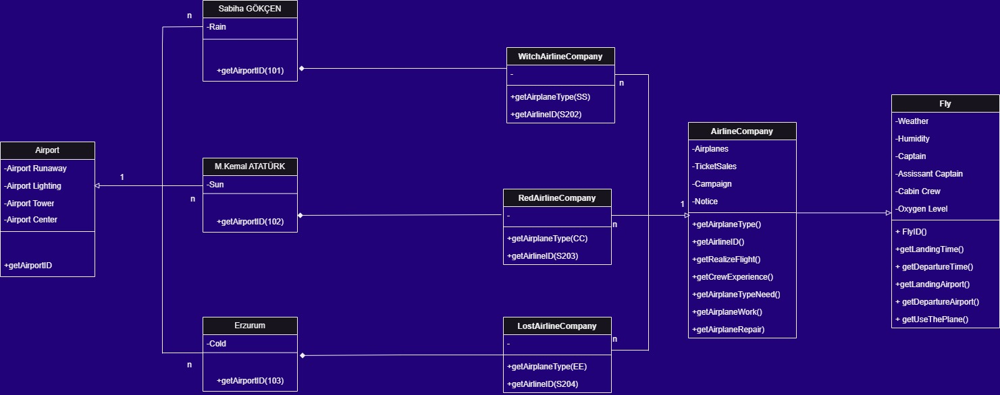

>**FlyClassDiagram**
***
```
* Hava yolu şirketleri uçuşları gerçekleştirir. Her hava yolunun bir kimliği vardır.
* Hava yolu şirketi, farklı tipteki uçaklara sahiptir.
* Uçaklar çalışır veya onarım durumunda olabilir.
* Her uçuşun benzersiz kimliği, kalkacağı ve ineceği havaalanı, kalkış ve iniş saatleri vardır.
* Her uçuşun bir pilotu ve yardımcı pilotu vardır ve uçağı kullanırlar.
* Havaalanlarının benzersiz kimlikleri ve isimleri vardır.
* Hava yolu şirketlerinin pilotları vardır ve her pilotun bir deneyim seviyesi mevcuttur.
* Bir uçak tipi, belirli sayıda pilota ihtiyaç duyabilir.
```
***
>**FlyClassDiagram**
***
```
* Airline companies operate flights. Each airline has an identity.
* The airline has different types of airplanes.
* Airplanes can be operational or in repair.
* Each flight has a unique identity, the airport where it will take off and land, and the departure and landing times.
* Each flight has a pilot and co-pilot and they operate the aircraft.
* Airports have unique identities and names.
* Airline companies have pilots and each pilot has a level of experience.
* An aircraft type may need a certain number of pilots.
```
***
***

***
***